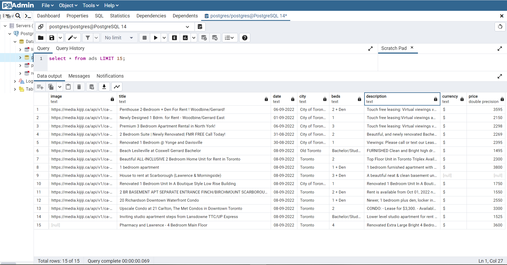

# Web Scraping Test Tasks

## Quick review
 This script collects all ads from site and writes data to database (PostgreSQL)

Image 1- Screenshot from PGAdmin

### In this task I used:
- lib requests for sending requests to the website;
- BeautifulSoup with lxml scrapper;
- SQLAlchemy ORM;
- pandas for creating dataframe and write it into database;
### In this project you can find .sql file with all request for creating a database with scrapped data.

## Tasks
From the website, https://www.kijiji.ca/b-apartments-condos/city-of-toronto/c37l1700273
collect all ads, pagination includes.
From every ad, you need to gather next points:
Image: save only url in database.
Date: save in format dd-mm-yyyy.
Currency must be saved as a separate attribute.
Save database dump to SQL file, with database creation schema.
## Technical requirements
- For sending requests to the website, you can use any of the following:
- requests, aiohttp, httpx.
- If you decide to render page to get information from site pages, use any of the
following:
- Selenium, Playwright.
- As ORM you can use the following:
- peewee, SQLAlchemy, mongoengine.
- Database for storing parsed data, any of the following:
- PostgreSQL, MySQL, MongoDB
## Must have
- Using of any virtual environment manager(venv, pipenv, poetry)
- All your source code should be uploaded to VCS. (GitHub, GitLab, Bitbucket)
## Nice to have
- Use docker.
- Asynchronous requests.
- Upload results into Google Sheet.
Result of task
Fully working code and SQL database dump that must be uploaded on any VCS. Please add
readme file with a short description of the project and instructions on how to set it up

## How to start

__Project uses python v.3.9__

***

## How to deploy

### Clone the _repo_:

> `git clone https://github.com/krasheg/web_scraping_task`

### Create the virtual environment in project and activate it:

> `cd web_scraping_task`

> `python -m venv venv`

> `source venv/bin/activate` On linux

> `.\venv\Scripts\activate` On Windows

### How to install project packages:

> `pip install -r requirements.txt`
